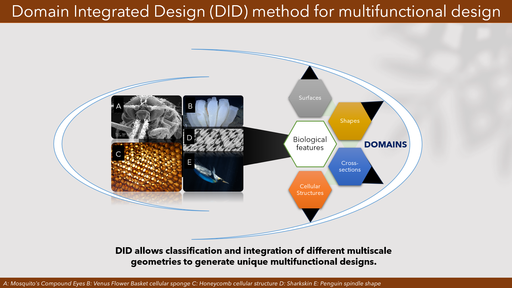
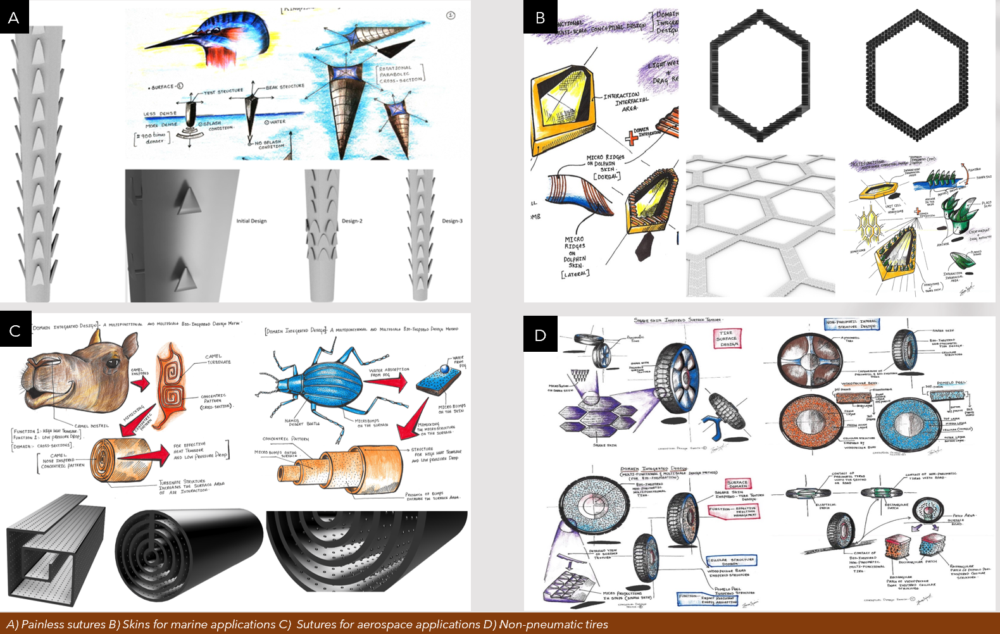

MBID is an idea generation system for generating unique multifunctional and multiscale conceptual designs. The Idea generation system comprises five components namely
1. **BIKAS**: Bio-inspired Knowledge Acquisition and Simulacrum, a knowledge database for abstraction of functions exhibited by biological features.
2. **Domain Integrated Design (DID)**: A method based on classification and integration of biological features based on their geometric designations.
3. **Meta-level design parameters**: Quantitative parameters for the selection between the biological features that exhibit the same function.
4. **Expandable Domain Integration Design (xDID)**: An extension of DID and a model representation of the ideation system.
5. **Verification**: Generation of unique multifunctional bio-inspired conceptual designs for verification of the system.

### BIKAS

BIKAS abbreviated as Bio-inspired Knowledge Acquisition and Simulacrum is a knowledge database developed to represent functions exhibited by biological features at their **embodiment-level** i.e. at their physical structure level. The function exhibited by the biological features is defined as a combination of integrated structure and structural strategy. Where the integrated structure here is defined as the multiscale structure.

1. **Biological Features**: The morphological and anatomical features observed in plant and animal kingdoms. 
2. **Biological Feature characteristics**: Describe a feature’s appearance, apparent form, or physical trait.
3. **Integrated Structure**: represents the physical description of a multiscale structure (e.g., Micro/ Nanostructure, Macrostructure, and the presence of wax layers on the Structure, etc.)
4. **Structural Strategy**: represents the integrated structural configuration (e.g., arrangement of the micro/nanostructure, packing of the micro/nanostructure, orientation of micro/nanostructure, symmetry, asymmetry, or patterns of 
 tessellations, etc.) and changes in the structural configuration due to stimulus. Stimulus is by the other interacting elements connected to the structure (e.g., erection of scales, change in skin compliance, etc.)

<figure>
    
    <figcaption>Abstraction of biological feature (Lotus Leaf) at its embodiment level.</figcaption>
</figure>

##### Publication

### DID and x DID
**Domain Integrated Design (DID)**: is a method that facilitates the classification and mapping of biological features that exhibit various functions. 
1. **Classification**: The biological features are classified by their feature characteristics into their respective geometric designations named as Domains. The domains are namely, Surfaces, Cellular Structures, Shapes and Cross-sections. Domains represent different biological features performing various functions with a common geometric designation.
Integration of the geometries from these domains results in the generation of multifunctional and multiscale conceptual designs.  
2. **Mapping**: The mapping of biological features to their respective tissue of origin initiates the search for alternative materials that replicate these biological properties effectively 

**Expandable Domain Integrated Design (xDID)**: The sheer variety of the biological features makes it impossible to classify them into a specific set of domains. Expandable domain integrated design (xDID) is an approach that facilitates the expansion by defining microdomains under each domain. For example, cellular structures can be further classified by the type of connections, such as beam-based connections and face-based connections. 

<figure>
    
    <figcaption>Abstraction of biological features at their embodiment function.</figcaption>
</figure>

##### Publications
1. Velivela, P.T. and Zhao, Y.F., 2022. A Comparative Analysis of the State-of-the-Art Methods for Multifunctional Bio-Inspired Design and an Introduction to Domain Integrated Design (DID). Designs, 6(6), p.120.
2. 

### Meta-level design parameters

##### Publication

### How does this work?
Based on the functional design requirements, biological features (multiscale structures) from different domains are combined to generate novel unique multifunctional, and multiscale bio-inspired conceptual designs.
1. A combination of Kingfisher’s beak from the cross-sections domain and barbs on the porcupine quill from the Surfaces domain resulted in the generation of a painless suture pin/leg design.
2.	A combination of Camel turbinates from the cross-section domain and micro-bumps on the Namib desert beetle from the surface domain resulted in the generation of structures for effective heat transfer and low-pressure drop potentially used in aerospace applications.
3.	A combination of woodpecker’s beak and pomelo peel from the cellular structures domain and snakeskin from the surfaces domain resulted in the generation of a non-pneumatic tire design for effective impact resistance and friction management.
4.	A combination of sharkskin and dolphin skin from the surface domain and honeycomb structure from the cellular structures domain resulted in the generation of skins for effective drag reduction and reduction in weight.

<figure>
    
    <figcaption>Abstraction of biological features at their embodiment function.</figcaption>
</figure>

##### Publications

##### Authors

This research was carried out by Pavan Tejaswi Velivela, under the supervision of Prof. Yaoyao Fiona Zhao, in the Mechanical Engineering department at McGill University.
  
##### Funding

This research work is supported by the Natural Sciences and Engineering Research Council of Canada Discovery Grant RGPIN-2018-05971 and MEDA (McGill Engineering Doctoral Award).
  
##### Contact

- For all queries related to the publications and potential collaborations contact: Prof. Yaoyao Fiona Zhao (Email: <yaoyao.zhao@mcgill.ca> or Visit Additive Design and Manufacturing Laboratory (ADML) <https://adml.lab.mcgill.ca/>
- Pavan Tejaswi Velivela (Email: <pavan.velivela@mail.mcgill.ca>; <pavan.velivela90@gmail.com>)

<h5> &copy; 2024 Pavan Tejaswi Velivela. All rights reserved </h5>
The land I work at is situated on the traditional territory of the Kanien’kehà:ka, a place which has long served as a site of meeting and exchange amongst many First Nations including the Kanien’kehá:ka of the Haudenosaunee Confederacy, Huron/Wendat, Abenaki, and Anishinaabeg.
