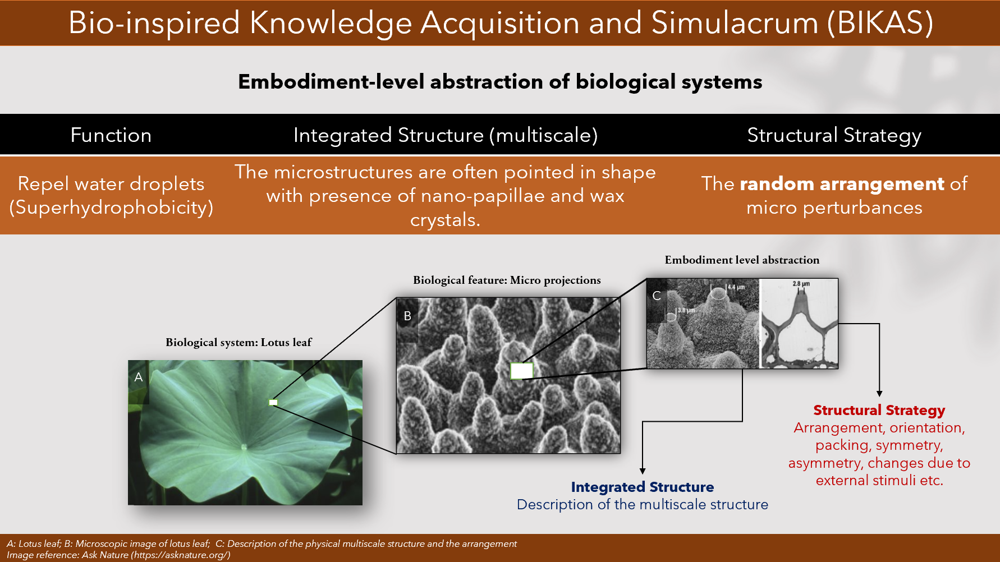

## Multifunctional Bio-Inspired Design (MBID)
MBID is an idea generation system for the generation of unique multifunctional and multiscale conceptual designs. The Idea generation system comprises five components namely
1. BIKAS: Bio-inspired Knowledge Acquisition and Simulacrum, a knowledge database for abstraction of functions exhibited by biological features.
2. Domain Integrated Design (DID): A method based on classification and integration of biological features based on their geometric designations.
3. Meta-level design parameters: Quantitative parameters for the selection between the biological features that exhibit the same function.
4. Expandable Domain Integration Design (xDID): An extension of DID and a model representation of the ideation system.
5. Generation of unique multifunctional bio-inspired advanced conceptual designs for verification of the system.

## How does this work?

## BIKAS

<figure>
    
    <figcaption>Abstraction of biological features at their embodiment function.</figcaption>
</figure>

## DID and x DID

## Meta-level design parameters

#### Creators
- This research was carried out by Pavan Tejaswi Velivela, under the supervision of Prof. Yaoyao Fiona Zhao, in the Mechanical Engineering department @ McGill University.
- The work is NaturalSciences and Engineering Research Council of Canada Discovery Grant RGPIN-2018-05971 and the McGill Engineering Doctoral Award (MEDA).

#### Correspondence
- For all queries related to the publications and potential collaborations contact: Prof. Yaoyao Fiona Zhao.
